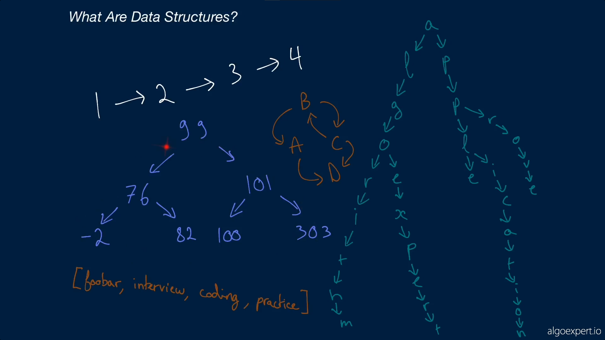
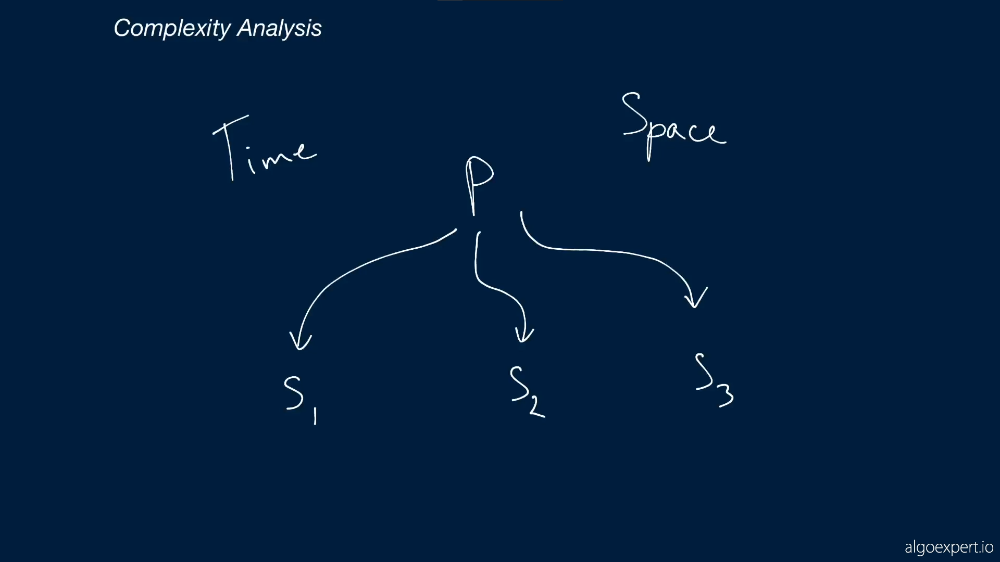
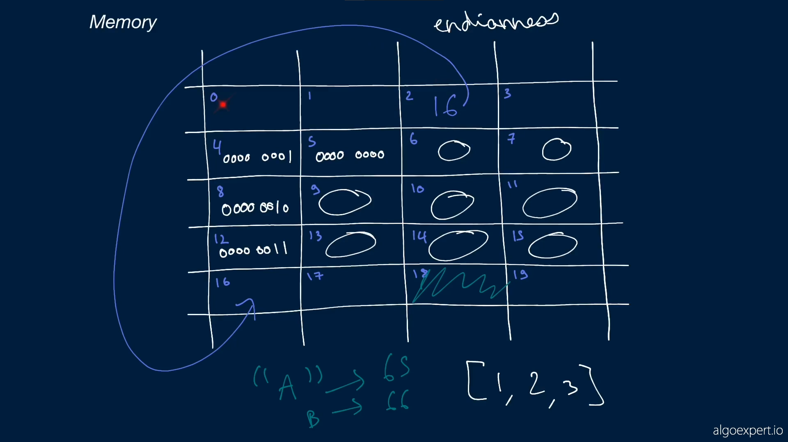
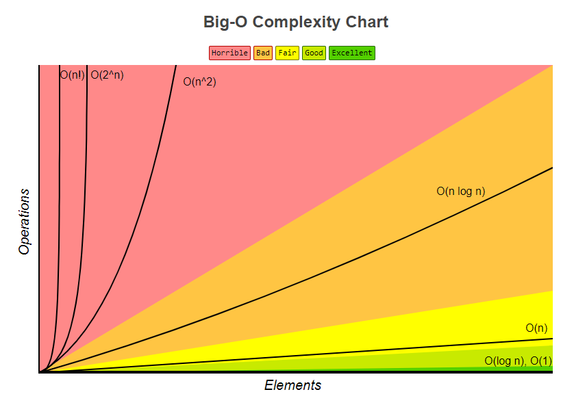
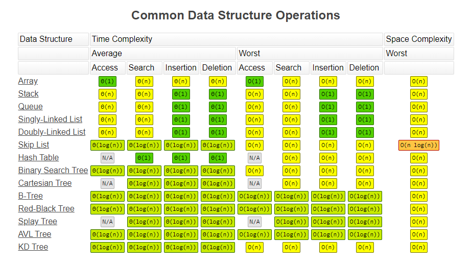
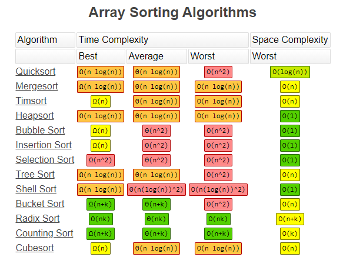

# Data Structures

Para manipular dados é necessário organizar, structuring and managing that, data structures is really a way to store and manipulate data.

data structure is a collection of data values, the relationship among them and the functions or operations that can be applied to the data.

# Complexity Analysis

Complexity analysis is the foundation knowledge to better understand data structures.

When dealing with a coding problem, its very common to have multiple solutions. What make a solution better than another?

What makes a solution better than another is whether or not it has a better complexity.

The better time and space complexity an algorythmn the better an algorythmn is.

Sometimes, an algorythmn has better time complexity then other, but worse space complexity, the better algorythmn depends on the use case of it.

## Time complexity

It's just a measure of how fast an algorythm or solution runs, the faster an algorythmn runs, the better its time complexity is.

## Space complexity

It's just a measure of how much memory or space an algorythm takes, the less memory an algorythmn takes, the better the algorythmn is.

# Memory

The less memory an algorythmn takes, the better it is, because whe have a finite amount of memory.

## Integers

When dealing with integers variables, the number of memory that variable takes, is always fixed, it does not increase as the number increases and continuos, if a string takes two blocks of memory to be stored, and the memory don't have two continuos blocks for storage, it can't be stored.

## Strings

Strings are mapped to a number, on the ASCII charactere mapping ("A" is mapped to 65), and that number is turned into bits, and thoses bits are stored as a list os numbers in memory.

## Pointers

Different then integers and strings, it turns outs we can store a memory address of another memory slot, this is usefull because instead of store a value that exists somewhere on momery, we can just store the memory address of that value, saving up memory space. 

And unlike list or numbers, with pointers you can point to memory addresses that are far away from the original address.

# Big O Notation

With time complexity, we are measuring then changing in speed of an algorythmn with respect to the size of the input.

And we only really care about the very significant factors in our algirythmn

Given the input array, where "a" size is a natural number:

$$
a = [ ... ]
$$

## O(1)

$$
f(a) => 1 + a[0]
$$

As the size of input increases, the speed of algorythimn does not change, it keeps constant.

## O (log n)

## O(n)

$$
f(a) => sum(a)
$$

As the size of input increases, the speed of algorythimn increases linarly. If we were suming every value of an array input whe would have to traverse through every value.

## O (n²)

$$
f(a) => pair(a)
$$

For every value on an input array, whe would have to traverse every array item.

## O (n log n)

## O (2)

## O (n!)

## O (n² + n + 1)

$$
f(a) => pair(a) + sum(a) + (1 + a[0])
$$

As n² is so much bigger than N + 1, this equation could be simplified as O(n²)

